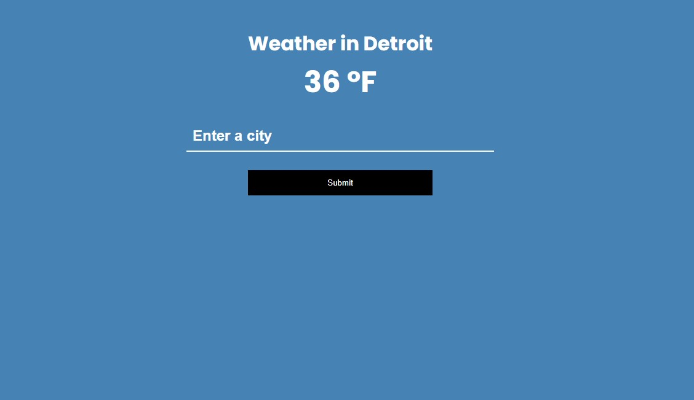

# nodejs-weather-api-project

Enter your city, see what the temp is right now!

App is running! Click [**here!**](https://nodejs-weather-api-proxy-serv.herokuapp.com/)

App created through Traversy Media's **'Node API Proxy Server Crash Course'**, 
which can be found [here](https://youtu.be/ZGymN8aFsv4)
